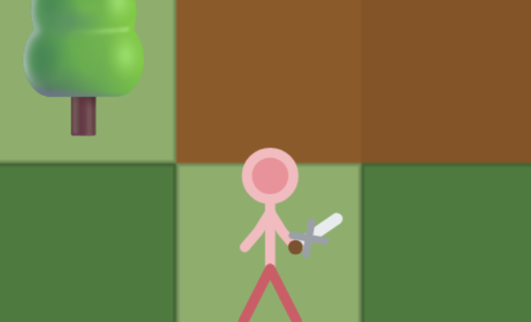

# Stick Tower Defense



A free browser-based tower defense game with stickman towers that level up and evolve into
distinct classes, an expanding spiral map, infinite waves, a hero item system, breakaway enemies
that ambush your towers, path-blocking barricades, forensic-grade blood/gore effects, and full
save/load. Single self-contained HTML file — no install, no build step, just open and play.

**[Play it here](https://sauerninja.github.io/StickTD/)** · **[Full changelog](https://github.com/SauerNinja/StickTD/blob/main/CHANGELOG.md)**

Zero dependencies: no external images, no external audio, nothing to install. Every stickman,
weapon, and effect is drawn procedurally on an HTML5 Canvas, and every sound is synthesized live
with the Web Audio API.

## Contents

- [How to play](#how-to-play)
- [Towers & evolutions](#towers--evolutions)
- [Tower appearance](#tower-appearance)
- [Enemies](#enemies)
- [Status effects](#status-effects)
- [Blood & gore](#blood--gore)
- [Leveling](#leveling)
- [Waves](#waves)
- [Pathing & AI](#pathing--ai)
- [Items & Heroes](#items--heroes)
- [Resources](#resources)
- [Huts](#huts)
- [Lives](#lives)
- [Settings](#settings)
- [Save / Load](#save--load)
- [Tech stack](#tech-stack)
- [Project structure](#project-structure)
- [Code map](#code-map)
- [Running locally](#running-locally)
- [Contributing](#contributing)
- [Version History](#version-history)
- [License](#license)

## How to play

- Tap **Build**, pick a tower, then tap a hedge tile to place it. It shows a brief class-flavored
  quip and plays a cute gibberish "spawn chatter" voice blip when placed.
- Tap a placed tower to see its nameplate — a portrait, HP bar, an EXP bar, and combat stats. Tap
  the nameplate again (or the scroll icon, which glows green when you have points to spend) to
  expand into full options: upgrade, sell, move, buy it gear from the **Shop**, cycle its
  targeting priority, or spend stat points.
- Every tower has its own EXP level, up to 99, separate from its gold-bought upgrade tier — see
  **Leveling** below. Investing enough points into one stat evolves the tower into a distinct new
  class — see the tree below.
- The map starts as a tiny 2x2 area and grows outward as you clear waves — some expansions are
  free milestones, others cost gold. Only one expansion can happen per round; extras queue for
  the next.
- The path is a genuine spiral, regenerated (and re-checked against your existing towers) every
  time the map expands.
- Waves continue indefinitely past 100 with procedurally scaling difficulty across 9 rotating
  wave archetypes — this is built to be a long-haul hero-building grind, not a sprint.
- Runs on desktop (mouse + scroll-to-zoom) and mobile (touch, pinch-to-zoom, drag-to-pan).
- Speed up simulation from 1x up to 10x via the HUD speed button. When a tower is selected and
  actively attacking, a red-bordered target frame shows what it's aiming at — HP, armor, and speed.

### Stat icon legend

Every icon used across the HUD, a tower's inspect panel, its target frame, and its stat buttons:

**Top HUD bar**
| Icon | Meaning |
|---|---|
| ❤️ | Lives remaining — reaching 0 ends the run |
| 💰 | Gold — spent on building most towers, upgrading, expanding, and the Shop |
| 🔀 | Free tower relocations left (earn 1 more every 2 waves, capped) |
| 🏗️ Build / 🛒 Shop / ⚙️ | Open the build tray, item shop, or settings |
| ⏸/▶ and 1x/2x/.../10x | Pause/resume and simulation speed |

**Tower inspect panel — combat stats** (left to right: HP/armor first, then the damage cluster)
| Icon | Meaning |
|---|---|
| ❤️ | Current / max HP |
| 🛡️ | Armor — percentage damage reduction on incoming hits |
| ⚔️ | Damage, shown as its real min-max range (the actual random roll band every hit uses) |
| 💥 | Critical hits — shown as chance, then ⚔️ and the damage multiplier (e.g. "2.5% ⚔️1.20") |
| ⏳ | Time per attack, in seconds — how long one full attack cycle takes, not a frequency |
| 🥈 | Real DPS — average damage per hit (crit's expected-value contribution included) × attacks/second, discounted by the tower's own miss chance (burst-fire towers use their true full attack cycle, not just the reload cooldown) |
| 🎯 | Range — attack radius in world units |
| 🍀 | Luck — bonus % gold from this tower's kills |

This row never wraps to a second line — if its content is too wide for the panel, it shrinks
(with no minimum size) to always fit on one line instead.

**Tower inspect panel — stat allocation**
| Icon | Stat | What it does |
|---|---|---|
| 💪 | STR | +3% max HP per point for every class; additionally the sole source of damage for Warrior-archetype towers (Swordsman and its evolutions), on a curve built to keep scaling meaningfully into the late game |
| 🏃 | DEX | Universal +3% attack speed, reduced miss chance, and 💥 crit chance per point for every class, regardless of archetype; additionally the sole source of damage for Archer-archetype towers |
| 🧠 | INT | +6 range and 💥 crit damage multiplier per point for every class (Cleric uses it to boost heal amount instead of range); additionally the sole source of damage for Mage-archetype towers |

Damage is strictly archetype-exclusive — only STR drives Warrior damage, only DEX drives Archer
damage, only INT drives Mage damage, with no cross-class bonus. Miss chance itself has a different
baseline per archetype on purpose (Mage misses the most at 22% starting out, Archer a moderate 14%,
Warriors the least at 7%), but the DEX formula that reduces it from there is identical for every
tower, with no exceptions. Critical hits work the same way: base 2.5% chance for 1.20x damage
before any investment, with DEX raising the chance (capped 50%) and INT raising the multiplier
(capped 3x) — a real damage effect now, applied before armor mitigation, not just a cosmetic
floating-text color.

**Tower strategy (the aura box)** — evolved/specialist towers (anything beyond base Swordsman/
Archer/Mage) show a round glowing WC3-style icon next to their inventory slots. Tap it to open a
one-line strategy note explaining that class's niche. Basic classes and Barricade don't have one —
they don't have a specialized niche yet to explain.

**Target frame** (shown when a selected tower is actively attacking something)
| Icon | Meaning |
|---|---|
| 🛡️ | The target enemy's armor |
| 👟 | The target enemy's movement speed |

## Towers & evolutions

> **Note for anyone editing this file or the code:** everything below is documented exactly, the
> way a technical reference should be — but the game itself deliberately does NOT show players this
> exact mapping. The in-game help modal and the Build menu's locked-row messages both use vague,
> thematic riddles instead (see `TOWER_UNLOCK_RIDDLE` in `buildTowerModal()`), on purpose, so
> discovering which stat/element leads where is part of the game. If you're tempted to make the
> in-game UI this precise to "match the docs" — don't; that's the opposite of the intent.

A tower never transforms into a new class — it keeps its own identity forever and just keeps
growing its own stats. What reaching certain thresholds *does* do: permanently unlock a different,
better tower as directly buildable from the Build menu, for the rest of the current game. Grind a
Swordsman's stats far enough and Spearman shows up as its own buildable tower — the Swordsman that
earned it stays a Swordsman. Only Swordsman, Archer, Mage, and Barricade start out buildable —
always exactly these 3 fighting classes plus Barricade, nothing else added to that list going
forward; everything else has to be unlocked first.

Unlocking happens in two stages: whichever stat reaches **100** first on a Swordsman/Archer/Mage
permanently locks in an element (STR → 🔥 Fire, DEX → ⚡ Electric, INT → ❄️ Ice) — the lock never
changes even if another stat later overtakes it — then reaching **500** in that same stat unlocks
that class's specialization for that element, if one is defined. A few specializations have a
further unlock of their own beyond that, at a flat stat threshold, unrelated to attunement.

**The first time any tower actually reaches an unlock threshold, that class becomes permanently
buildable for the rest of the game** — it shows up directly in the Build menu from then on,
buildable for gold like any starter. This persists across save/load and resets on a new game, same
as the existing wave-gated starter unlocks. Not-yet-reached classes show up in the Build menu
grayed out with a 🔒 and a message explaining exactly which class + stat threshold unlocks them —
e.g., reaching ❄️ Ice on a Swordsman (INT 500) unlocks Spearman as directly buildable from then on.

**Two economy rules on top of the above.** Swordsman, Archer, and Mage stay genuinely unlimited in
count, but each one you already have on the board makes the next one cost more — 20% more per
existing copy of that same type, compounding (a 💰50 Swordsman becomes 💰60 for a 2nd, 💰72 for a
3rd, and so on). Paladin, Squirtgun, Sniper, Pope, and Necromancer are capped at **one active copy
on the board at a time** instead — the first four as the single deepest evolution in each lineage
that has one, Necromancer as a deliberate exception despite being only a first-tier specialization.
The Build-menu row shows "already on the field" and can't be selected again until that one is sold
or dies, at which point the slot opens back up.

| Tower | Role |
|---|---|
| ⚔️ Swordsman | Melee cone sweep — the starting warrior |
| 🏹 Archer | Ranged, visibly draws the bow before firing — slower arrows, real power behind each shot |
| 🔮 Mage | Slows whatever it hits, small chance to burn, freeze, or shock |
| 🚧 Barricade | Doesn't attack — extremely tough, placeable directly on the path, freezes the first enemy that touches it |
| 🔨 Hammerman | *(unlocked by 🔥 Fire on a Swordsman, STR 100/500)* Stuns on hit, carries a shield and extra HP |
| 🪓 Axeman | *(unlocked by ⚡ Electric on a Swordsman, DEX 100/500)* Dual hand axes; manually toggle between a close swing and a ranged throw |
| 👹 Berserker | *(unlocked by an Axeman reaching STR 40)* Trades the throw-toggle for a much wider, harder cleave — brute-force AoE over precision |
| 🔱 Spearman | *(unlocked by ❄️ Ice on a Swordsman, INT 100/500)* Long melee reach, slow but hard-hitting |
| 🎯 Lancer | *(unlocked by a Spearman reaching DEX 40)* Even longer reach than base Spearman — the longest-ranged melee class in the game |
| ⚜️ Paladin | *(unlocked by a Hammerman reaching INT 40)* Every hit deals holy pure damage, bypassing armor entirely |
| 🔫 Gatling | *(unlocked by 🔥 Fire on an Archer, STR 100/500)* Very fast, low damage per shot — shreds swarms |
| 🎯 Blowdart | *(unlocked by ⚡ Electric on an Archer, DEX 100/500)* Short range, fast fire rate, every dart poisons |
| 🔫 Dual Squirt Gun | *(unlocked by a Blowdart reaching DEX 40)* Dual-wielded, deeper DEX specialization |
| ♨️ Blow Gunner | *(unlocked on an Archer that pushes BOTH STR and INT to 500 — 🔥 Fire + ❄️ Ice = "Steam")* Every hit carries both a poison DoT and a brief chilling slow at once. The first dual-element hybrid class — doesn't replace Gatling/Marksman's own single-element unlocks, unlocks alongside them off the same stat growth. |
| ☄️ Proton | *(unlocked on ANY base class — Swordsman, Archer, or Mage — that pushes BOTH STR and DEX to 500 — 🔥 Fire + ⚡ Electric)* Purple energy that burns on contact and briefly disrupts the target's speed. Unlike every other hybrid/specialization, not tied to one base class — whichever tower gets there first unlocks the same shared class. |
| 🕳️ Dark Matter | *(unlocked on ANY base class that pushes BOTH DEX and INT to 500 — ⚡ Electric + ❄️ Ice)* Same shared-across-all-3-bases shape as Proton. Leans toward the slow more than the burn — a control identity rather than a damage one. |
| 🌟 Quasar | *(unlocked on ANY base class that pushes STR, DEX, AND INT all to 500 — 🔥+⚡+❄️, all three)* The hardest unlock in the game by a wide margin — 1500 total stat points, not 1000. Hits everything in a small splash radius, not just its direct target, on top of the same burn+slow every hybrid carries. |
| 🔫 Marksman | *(unlocked by ❄️ Ice on an Archer, INT 100/500)* One carefully aimed rifle shot at a time — longer range and harder-hitting than base Archer |
| 🎯 Sniper | *(unlocked by a Marksman reaching INT 60)* The deepest INT investment in the game — one devastating shot at the longest range of any tower |
| 🐈‍⬛ Cat Snapper | *(unlocked by an Archer reaching DEX 500 — a raw stat threshold, not gated through an element; all 3 of Archer's own element slots were already taken)* Throws a temporary shadow cat instead of dealing damage directly — the cat latches onto its target and scratches for a few seconds, up to 2 cats out at once |
| ⚡ Snap Caster | *(unlocked by ⚡ Electric on a Mage, DEX 100/500)* Faster casts than base Mage, with a chance to chain lightning to a nearby second target |
| ✝️ Cleric | *(unlocked by ❄️ Ice on a Mage, INT 100/500)* Curses the nearest enemy of any type with a lingering damage-over-time affliction — 5x tick damage against undead. Also heals your lowest-HP tower once per wave. |
| 💀 Necromancer | *(unlocked by 🔥 Fire on a Mage, STR 100/500)* Fires a dark bolt, and raises a small band of skeleton minions near itself at the start of every round — gone again the instant the round ends. Capped at one active on the board at a time. |
| 🧑‍🦳 Pope | *(unlocked by a Cleric reaching INT 750)* Cleric's ultimate form as a separate tower — the curse hits every enemy in range at once instead of one target, still 5x against undead. A visibly growing hat on any Cleric telegraphs its own approach to this unlock threshold, from 500 to 750 INT — the Cleric doesn't become Pope, it just earns the unlock. |
| 💣 Bomber | *(unlocked by a Gatling reaching STR 40)* Splash damage against groups — the intended "Gatling → Bomber" deep tier, previously deferred pending a real threshold decision, now decided. |
| 🔫 Gunalinder | *(unlocked by a Bomber reaching INT 40)* Trades splash for precision — fires all six chambers of a revolver in a rapid burst, then a long reload. |

Every buildable evolved class now traces to a real, reachable unlock path — no orphaned classes.

Gold-tier upgrades (paid with gold, separate from EXP levels) raise range, cooldown, and unlock
class mechanics, with a modest damage bump included — but damage growth is weighted so a tower's
**primary stat** (see Leveling) is the dominant lever for how hard it actually hits, not the tier
level by itself.

## Tower appearance

Every individual tower rolls its own unique look the moment it's built, independent of every
other tower of the same class:

- **Height & weight** — a per-tower silhouette variance around that class's baseline proportions,
  so two Mages (for example) can read as visibly taller/leaner or shorter/stockier rather than
  sharing one fixed build.
- **Skin tone & pants tone** — each rolled as a fully independent random shade across a wide
  range, not tied to each other and not anchored to the class's own preset color, so within one
  class you'll see every combination: darker skin with lighter pants, lighter skin with darker
  pants, or anything in between. Hue stays per-class (Mage always reads violet, Archer always
  reads green); only lightness is randomized.
- **Face color** is the one deliberate exception — always a subtle shade darker than that
  specific tower's own skin tone, so the face reliably reads as part of the same figure.
- **STR mustache** — once a tower's STR exceeds 47, it grows a mustache that gets visibly bigger
  with additional STR, up to a capped maximum (full size by 97 STR). Color is rolled once from a
  realistic human hair palette (black, brown, blonde, ginger, gray, auburn), same as skin and
  pants tone.

Re-rolled (fresh randomization) on **upgrade** and on **evolution**, so leveling up and evolving
visibly show growth and change, not just a stat readout.

## Enemies

Grunt, Swarm, Tank, and Runner make up the early roster, alongside a Boss on wave 15. Fire and
Ice enemies can break off the path entirely to 1v1 a tower directly, inflicting burn or a slow
debuff on it. Splitter breaks into two smaller Splitmini on death; Boulder does the same but
tankier. Healer keeps nearby enemies topped up; Shielded absorbs hits until its shield breaks.
Wolf hunts in a coordinated pack. The Troll has a big bounty and roughly double HP, but walks
*backward* toward the entrance instead of forward — kill it for the payout before it wanders off.

**Undead** (Zombie, Wraith, Skeleton, Reaper) carry real armor and are the intended target for a
Cleric's curse, which deals 5x damage to them specifically. Skeleton revives once on death.
Reaper is the heaviest-armored undead in the roster.

## Status effects

Burn, curse (poison-style DoT), bleeding (see [Blood & gore](#blood--gore)), slow, and stun all
show a periodic reminder label above an affected unit every 120 seconds, so long-running effects
stay visible instead of only appearing the instant they're applied. Each also gets a themed visual
— drifting ice crystals for slow/freeze, flickering flames for burn, lightning bolts orbiting the
head for stun — instead of a flat colored tint. A stun or slow correctly propagates backward
through an entire queued line of enemies, not just to the one directly behind it.

## Blood & gore

An 18+ toggle in Settings → Game controls all of it — off by default. With it on, damage produces
biologically-flavored, forensic-style bloodstain effects rather than a generic hit spark:

- **Cast-off arc direction is now a fixed per-tower handedness, not a fresh random coin-flip on
  every hit** — a real swordsman swings with a consistent dominant direction, and the blood now
  matches. A brief "air line" also traces the blade's actual swept path at the moment of the
  swing, geometrically identical to the angle driving the cast-off, so the blood pattern is
  directly, visibly verifiable against the swing that caused it.
- **Ground-pool size now reads directly from where a hit's damage roll landed in its own min-max
  range, AND from the actual target's own body size** — a genuine minimum-roll hit pools ~30%
  smaller, a genuine maximum-roll hit ~30% bigger, shown alongside the tower's min-max damage
  range in its stat panel; independently, a tiny Swarm ant leaves a visibly smaller pool than a
  Boss for the same weapon type, instead of every enemy producing an identically-sized pool
  regardless of how big or small its own emoji actually is. The same size-blending applies to
  death-burst particle counts, not just the pool.
- **Per-species blood profiles** — insects (green hemolymph), undead (necrotic dark ooze), and
  rock/stone-bodied enemies (Boulder, Rocklet, Tank — no blood at all, only dust and small 🪨
  chip debris, 2-5 scattered on death and a 1-in-10 chance per non-lethal hit, each chip a fixed
  1/10 of the enemy's own size) each bleed a distinct color and texture, and every individual
  enemy additionally rolls its own subtle blood tint, so no two enemies bleed an identical, flat
  color.
- **Weapon-specific wound identity** — melee sub-branches by actual weapon geometry: a bladed cut
  (cut-line plus a curved cast-off arc trailing away, matching how blood actually flies off a
  swinging blade), a blunt crushing impact (wider radial spatter plus a circular shockring — the
  one case where a round mark is forensically correct), or a piercing thrust (a strong forward
  gush along one line, no perpendicular cut). Archer hits stay low-impact and puncture-like
  (minimal spray, mostly dripping). Mage hits are a fast, wide, high-energy burst of long
  radiating cast-off streaks with a touch of back-spatter toward the source — no ring, since a
  magical bolt has no crushing surface to leave a round mark. Ground stains persist with distinct
  shape and size per archetype too — Archer pools are small and elongated, Mage pools are the
  largest of the four.
- **Running drip trails** — a gently curved, gravity-affected trickle with a small pooled bead at
  the tip, distinct from the initial impact streak — this is what blood does a beat *after*
  landing, not another copy of the impact spatter.
- **Bleeding (DOT)** — a sufficiently heavy hit opens an actual wound: a ticking
  damage-over-time effect that keeps the enemy actively bleeding (tapering off as the wound nears
  its end, not cutting off at full intensity) on top of ambient low-HP dripping below 40% HP.
- **Barricade contact-transfer smears** — an enemy pressed against a barricade while bleeding
  leaves a directional wipe stain on the barricade itself, not just a puddle beneath it.
- **Walking blood / footprints** — an enemy that steps in fresh blood (including the edge of a
  large pool, not just its exact center) picks it up and leaves a fading trail of footprints.
- **Forensic aging** — a fresh stain is bright oxyhemoglobin red, passes through a reddish-brown
  oxidizing stage as it dries, and (once old enough) shows a darker, coagulated skeletonization
  ring around a lighter, flatter interior — real bloodstain-pattern-analysis aging, not a flat
  color fade. Every stain lasts up to 30 minutes with individual per-decal variance, and a local
  saturation cap keeps a heavily-fought corridor from growing into one unbroken mass.
- **Instant, not delayed** — every blood effect fires at the actual moment of the hit or the
  moment of death, at full size immediately — no delayed trickle, no grow-in animation.
- **Skeletal remains and the worms that eventually crawl out of them** — a death has a 78% chance
  to scatter a few bone fragments and a 45% chance to leave a skull, both permanent (never fade)
  and always rendered above blood, guaranteed by draw order rather than left to chance. Each round,
  every skull on the map has a 1-in-10 chance to be marked for a worm — which doesn't actually
  appear until the round *after* it's rolled — and each skull only ever grows one. A worm never
  fades either, but it isn't permanent: it lives twice as long as a blood stain and shrinks
  smoothly to nothing near the end of its life instead of fading out, like it's burrowing away.

## Leveling

Each tower has two separate progression tracks, both capped: **500 per stat, 1,000 combined.**

- **Training (XP).** The killing blow earns the enemy's full XP — Tiny 17, Small 20, Standard 25,
  Large 40, Boss 50. Other towers that damaged it (burn, poison and bleed included) split a smaller
  assist share by damage dealt; an enemy that already crossed the finish only pays a reduced
  cleanup share. Every 100 XP fills a training bar and rolls **2 × (1–3) stat points**. A bar only
  awards what still fits under the cap, and once a tower is full its XP is held until you spend the
  points you have — nothing is lost.
- **Promotion (gold).** Rolls 1–3 into each stat plus 1–3 into the class's main stat, capped, and
  nothing else: promotion rank never changes damage, cooldown or range. Cost grows ×1.5 per
  promotion (80 → 120 → 180 → 270 → …), and it's unavailable when there's no room left under the cap.

**Milestones.** At **500 total trained stats** you can name the unit (it shows as "MuhMan ⚔️").
At **1,000** it is fully trained: it gains the trophy and its XP share becomes gold at 25 XP = 1.
Neither milestone grants damage, HP or shields.

**What each stat buys at the 500 cap:** main stat +75% damage; DEX up to 2× attack rate (Archers
get 40% of that, since DEX is already their damage stat); INT reaches the class range cap and
improves accuracy and utility; STR up to 3× max HP, which is what keeps a tower alive in late waves.

**Elements.** At 100 in a stat a stickman attunes — STR gives Fire (burn), DEX gives Electric
(shock), INT gives Ice (chill). Training **two** stats to 500 mixes an advanced element:
Fire+Electric = **Proton** (melts: burn plus bonus damage), Fire+Ice = **Dark Matter** (stuns),
Electric+Ice = **Quasar** (blinds: a long slow). Proton, Quasar and Dark Matter are elements, not
towers — you can't build them. Every attack carries your element: projectiles and melee swings take
its colour, and the proc chance climbs from 8% at attunement to 32% at the 500 cap.

**Class unlocks:** attunement at 100 in a stat; specializations at 500 in the attuned stat; an
Archer that reaches 100 STR unlocks the **Crazy Chef**, a knife-thrower who scales on Strength and
hurls five kitchen knives before restocking for ten seconds; Pope at 500 INT plus 750 total on a
Cleric.

**Spending points:** tap a stat to spend one, hold to keep spending. The hint above the buttons
shows your next unlock, and adds a naming or mastery countdown only when one is close.

**Targeting modes:** First, Closest, Strongest, Weakest, **Farm** (chases killing blows it can land
next hit), **Assist** (leaves killing blows to others) and **Unclaimed** (skips enemies already
doomed by shots in flight).

## Waves

**Wave structure (1.3.0+).** Every wave marches in strict size order: all the Tiny enemies first,
then Small, then Standard, and — only on every fifth wave — the Large enemies and Bosses at the very
end. The next group never leaves the gate until everything ahead of it has been killed or has
crossed the finish line. Bigger always means slower, tougher, and worth more XP, and there are at
least five little enemies for every big one. Each new enemy family gets a five-wave chapter:
introduction, reinforcement, combination, a big farming wave, and a mastery finale.

**Training XP.** The tower that lands the killing blow gets the full XP (Tiny 17, Small 20,
Standard 25, Large 40, Boss 50); every 100 XP fills a training bar and rolls two dice of 1–3 stat points (2–6 per bar, 4 on average). Towers
that only helped split a small assist bonus. An enemy that already crossed the finish line only
pays a reduced cleanup share when it finally dies.

100 hand-authored waves, then infinite procedurally-generated ones cycling through 9 archetypes —
Standard, Swarm Surge, Elite Vanguard, Undead Uprising, Ambush Tactics, Siege Assault (boss rush),
Stone Push (a heavily-armored crowd-control test), Trick Rush (looks like an easy opener, then
springs a real threat partway through), and The Grind (a long, sustained economy/DPS test rather
than a fast burst). A Boss periodically spawns Grunt minions while active; an off-screen compass
arrow points toward it when it's out of view.

The first 15 waves each introduce at most one brand-new enemy type, with a popup explaining its
HP, speed, bounty, and any special behavior the first time it appears. A summary popup at the end
of every wave shows total gold gained and a per-class EXP breakdown.

Enemies within a wave are spaced out on spawn — both within one enemy type's own group and across
every other group spawning that same wave — so a wave with several concurrent enemy types never
dumps them all onto the entrance at the exact same moment.

## Pathing & AI

Enemies path along the map's spiral in genuine single file: a faster unit won't try to overtake
a slower one directly ahead of it (there's no lane to pass in), a queue naturally forms behind an
active Barricade with only one enemy actually engaging it at a time, and a swept collision check
catches fast-moving units that would otherwise tunnel straight through each other within a single
frame. Wave spawning pauses while a barricade queue is backed up rather than piling more enemies
onto it, with a safety timeout so a jam can never permanently block progress. Corner-turning uses
a forgiving waypoint-arrival margin so units don't overshoot and backtrack into the units behind
them.

## Items & Heroes

Every tower starts with empty item slots — WC3/Dota-style, not a class-specific starter kit.
Two shared items exist, usable by any tower regardless of class: the **Lucky Branch** 🌿 (+1
STR/+1 DEX/+1 INT, gold + wood), and the **Barricade** 🚧 item (see Resources below) — both
buyable from the Shop for whichever tower you have selected. Items can be dragged directly from
one tower's inventory onto another to transfer them, or dropped on the ground first. A ground
item bobs gently with a soft pulsing ring around it at every graphics setting, and while you're
actively dragging one, a 👇🏻 indicator appears above whichever tower is currently the valid drop
target. Global passive upgrades apply to every tower you own, current and future. A tower with all
6 item slots filled awakens into a **Hero**, with a permanent stat bonus and a visible crown, and
its own distinct sound. A tower whose STR+DEX+INT reaches 100 total becomes **Legendary** — a
separate, rarer milestone with its own small permanent stat bonus, a player-chosen name, and the
biggest fanfare in the game.

## Resources

Gold from kills and wave clears — spent on most towers, upgrades, and expanding the map. Wood and
stone from clearing scattered trees and rocks (rocks cost noticeably more gold to clear than an
equivalently-sized tree), rare treasure chests, and relic drops — spent on the priciest tier of
shop gear, and on **Barricades**. Barricades aren't built from the Build menu — they're bought as
an item from the Shop (600🪵/300🪨) into a tower's inventory, then dragged out onto a valid path
tile to place them live, or onto any tower's inventory to store or move them; a live Barricade can
be picked back up with its "Store" button. Every 5 waves cleared banks one free-barricade charge
(capped at 3), consumed automatically on your next Barricade purchase before any wood/stone is
spent. Tank (🗿) drops stone instead of gold on death — the game's one enemy-side source of stone
beyond clearing rocks yourself.

## Huts

A WarCraft 3-style creep camp: a stationary hut (🛖) placed off-path somewhere in the starting
map area, guarded by 2 enemies. Nothing about it is on the timer or the path — towers in range
simply fight it like anything else, on your own schedule. Kill both guardians for an immediate
gold bounty each; the hut itself is far tankier and pays a much bigger one-time reward when
destroyed. If you clear the guardians but leave the hut standing, it respawns 2 fresh guardians
after a random 1-5 minute real-time wait — but only once the lane around it is actually empty, and
never at all once the hut itself has been torn down. A cleared hut stays cleared permanently.

## Lives

Start with 100. Buy an extra life with gold from the **Shop** — each purchase costs
substantially more than the last (exponential scaling), so it's a real emergency valve rather
than a routine top-up.

An enemy costs a life the instant its entire body has crossed the checkered finish line at the
end of the path — not the moment it merely reaches the last tile. It doesn't disappear after
that: it keeps wandering the map aimlessly and stays a fully live, killable target (same gold/EXP
drop as any other kill) — and it doesn't get swept away at the start of the next round either, it
genuinely persists until something actually kills it, across as many rounds as it takes. Giving
the lull between waves something to do beyond waiting, and a real reason to actually do it: a
wandering enemy left alone has a high, periodically-rerolled chance of finding and directly
attacking a nearby tower.

## Settings

Video (graphics quality: Low / High, trading off shadows and particle-heavy effects for
performance), Audio (mute), Game (18+ gore toggle, save/load), and About (in-app README
viewer/downloader, plus **Download Debug Log** — one text file with live performance stats, full
game/settings state, audio engine status, entity pool counts, and browser/device info, for
attaching to a bug report).

## Save / Load

Progress isn't auto-saved. Settings → Game → **Save Game** downloads a `.txt` file with a random
seed and your full game state. **Load Save** on that same screen restores it — on this device or
any other.

## Tech stack

- **HTML5 Canvas 2D** for all rendering — every stickman, weapon, enemy, particle, and decal is
  drawn procedurally with `CanvasRenderingContext2D` calls, no sprite sheets or image assets.
- **Vanilla JavaScript**, no framework, no bundler, no transpilation step.
- **Web Audio API** for synthesized sound effects — no audio files.
- **A single self-contained `index.html`** — HTML, CSS, and JS all live in one file by design (see
  [Contributing](#contributing)), so the entire game is one download and one `<script>` tag away
  from running.

## Project structure

```
StickTD/
├── index.html      # the entire game — markup, styles, and all game logic
├── AGENTS.md        # workflow rules for AI agents/contributors making changes
├── CHANGELOG.md      # full version history, newest first
├── BACKLOG.md        # ideas and planned features not yet built
├── LICENSE            # MIT
└── README.md          # this file
```

## Code map

Direct links into `index.html` on GitHub, jumping straight to where each system actually lives.
Line numbers drift as the file changes — treat these as a starting point to search from rather
than a permanently exact address, and if a link lands a little off, the section-header comment
right above that spot (`/* ===== ... ===== */`) is the reliable anchor, not the line number itself.

**Wave, XP and performance systems (1.3.0+)** — search for these names:
- `buildWavePlan()` / `validateWavePlan()` / `SIZE_TIER_BANDS` — seeded wave construction, size
  tiers, boot-time validation of waves 1–120.
- `advanceWaveDispatch()` / `currentBatchReleased()` — phase-strict, batch-overlapping dispatch.
- `Enemy.applySizeTier()` / `Enemy.packedSpeed()` / `Enemy.recordContribution()` — size stats,
  tier speed ceiling, damage ledger.
- `awardKillExperience()` / `creditKill()` / `distributeSharedXp()` / `gainTowerExp()` — XP.
- `Tower.upgrade()` / `promotionCostFor()` / `promotionCapacity()` / `Tower.targetScore()` — promotion and targeting.
- `STAT_EFFECT_CAP` / `STAT_TOTAL_CAP` / `refreshProgressionMilestones()` / `progressionMilestoneNote()` — stat caps, naming at 500, mastery at 1,000, XP-to-gold.
- `MIXED_ELEMENT_RULES` / `refreshElementState()` / `applyAttunementStatus()` / `ELEMENT_VISUALS` — element mixes, on-hit status and the elemental projectile/swing visuals.
- `dpsBreakdownText()` / `maybeShowUpdateNotice()` — the tap-to-explain DPS panel and the what's-new dialog.
- `drawDebugOverlay()` / `panCameraToTower()` / `Tower.drawBloodLustAura()` — debug mode, killstreak pan and aura.
- `sweepSettledDecals()` / `isDecalBakeEligible()` / `blitWorldLayer()` — gore baking and
  viewport-cropped world layers.
- `buildEnemyHash()` / `spatialCellKey()` / `queryNearby()` — integer-keyed spatial hash.
- `applyPanInertia()` / `requestPausedRender()` — camera glide and paused-render coalescing.

**Major sections**
- [Config (tunables, tower/enemy stat tables)](https://github.com/SauerNinja/StickTD/blob/main/index.html#L700)
- [Map / path generation](https://github.com/SauerNinja/StickTD/blob/main/index.html#L1212)
- [Scenery (trees/rocks)](https://github.com/SauerNinja/StickTD/blob/main/index.html#L1434)
- [`CONFIG.FLORA` / `spawnFlora()` — sparse cosmetic ground-cover accents, baked into the static map layer](https://github.com/SauerNinja/StickTD/blob/main/index.html#L1533)
- [`scheduleLeafGust()` / `updateAndDrawBlowingLeaves()` — one ambient gust of leaves drifting across the screen, 20-60s into a game](https://github.com/SauerNinja/StickTD/blob/main/index.html#L6515)
- [`ATTUNEMENTS` / `SPECIALIZATIONS` — the two-stage elemental attunement (100, permanent lock) + specialization (500) tables](https://github.com/SauerNinja/StickTD/blob/main/index.html#L1206)
- [`checkAttunementAndSpecialization()` — the runtime check for the above, called from `checkEvolution()` for the 3 base classes only](https://github.com/SauerNinja/StickTD/blob/main/index.html#L5214)
- [`unlockedTowerTypes` / `unlockTowerTypeBuild()` — first-reach-ever permanently unlocks a tower type as directly Build-menu-buildable (every tier, not just base-class specializations)](https://github.com/SauerNinja/StickTD/blob/main/index.html#L1363)
- [Audio synthesis (`SoundEngine`)](https://github.com/SauerNinja/StickTD/blob/main/index.html#L2015)
- [Game state / save-load](https://github.com/SauerNinja/StickTD/blob/main/index.html#L2046)
- [Camera (zoom + pan)](https://github.com/SauerNinja/StickTD/blob/main/index.html#L2380)
- [Entity classes (Enemy, Tower, Projectile)](https://github.com/SauerNinja/StickTD/blob/main/index.html#L2500)
- [Stickman rendering](https://github.com/SauerNinja/StickTD/blob/main/index.html#L5139)
- [Spatial hash](https://github.com/SauerNinja/StickTD/blob/main/index.html#L5699)
- [Waves](https://github.com/SauerNinja/StickTD/blob/main/index.html#L5888)
- [Main loop (fixed timestep)](https://github.com/SauerNinja/StickTD/blob/main/index.html#L6095)
- [Canvas / input setup](https://github.com/SauerNinja/StickTD/blob/main/index.html#L6321)
- [UI wiring](https://github.com/SauerNinja/StickTD/blob/main/index.html#L6593)
- [Start / end screens](https://github.com/SauerNinja/StickTD/blob/main/index.html#L7338)
- [Boot](https://github.com/SauerNinja/StickTD/blob/main/index.html#L7424)

**Core gameplay systems**
- [`CONFIG.TOWERS` (per-tower stats/tiers)](https://github.com/SauerNinja/StickTD/blob/main/index.html#L932)
- [`CONFIG.ENEMIES` (per-enemy stats)](https://github.com/SauerNinja/StickTD/blob/main/index.html#L1069)
- [`SPLIT_CHILD_TYPE` — which fragment type a splitting enemy leaves behind (Splitter→Splitmini, Boulder→Rocklet)](https://github.com/SauerNinja/StickTD/blob/main/index.html#L896)
- [`updateBarricadesAndPileup()` — barricade contact, enemy queueing](https://github.com/SauerNinja/StickTD/blob/main/index.html#L1493)
- [`computeFinishLine()` — shared geometry for the finish-line carpet render and the full-body crossing check; `reachEnd()`/`updateEscaped()` — an enemy that crosses wanders as a live target instead of despawning](https://github.com/SauerNinja/StickTD/blob/main/index.html#L2681)
- [`class Enemy`](https://github.com/SauerNinja/StickTD/blob/main/index.html#L2502)
- [`class Tower`](https://github.com/SauerNinja/StickTD/blob/main/index.html#L3342)
- [`class Projectile`](https://github.com/SauerNinja/StickTD/blob/main/index.html#L4249) — includes `pointSegmentDist2()`, the swept-collision check that stops fast projectiles (Mage especially) tunneling through moving targets
- [`class CatCompanion`/`drawCat()`](https://github.com/SauerNinja/StickTD/blob/main/index.html#L8111) — Cat Snapper's pooled temporary companion (follows its target's current x/y, never the path itself) and the shared procedural cat renderer both the companion and Cat Snapper's own idle pose use
- [`class SkeletonMinion`/`raiseSkeletonsForTower()`](https://github.com/SauerNinja/StickTD/blob/main/index.html#L8195) — Necromancer's pooled round-scoped minions (raised in `startNextWave()`, destroyed on wave-complete), and `drawSkeleton()` just below it
- [`findTarget()` — per-tower targeting, including Mage's wide hysteresis margin to avoid mid-charge target snapping](https://github.com/SauerNinja/StickTD/blob/main/index.html#L3342)
- [`drawStickman()` — procedural tower/weapon rendering](https://github.com/SauerNinja/StickTD/blob/main/index.html#L5221)
- [`checkStallWatchdog()` — anti-bunching failsafe](https://github.com/SauerNinja/StickTD/blob/main/index.html#L5717)
- [`resolveSweptEnemyCollisions()` / `resolveEnemyCollisions()`](https://github.com/SauerNinja/StickTD/blob/main/index.html#L5756)
- [`generateProceduralWave()` and its 9 named flavor generators (Swarm/Elite/Undead/Ambush/BossRush/Vanguard/Trick/Grind/Standard)](https://github.com/SauerNinja/StickTD/blob/main/index.html#L6765)
- [`validateGameDefinitions()` — boot-time cross-reference check across every data-driven config table](https://github.com/SauerNinja/StickTD/blob/main/index.html#L1323)
- [`update(dt)` — the actual per-frame simulation tick](https://github.com/SauerNinja/StickTD/blob/main/index.html#L6100)
- [`render(ctx)` — the actual per-frame draw call](https://github.com/SauerNinja/StickTD/blob/main/index.html#L6225)
- [`updateHUD()`](https://github.com/SauerNinja/StickTD/blob/main/index.html#L6610)
- [`fitHudTopToOneLine()` — scales the whole top bar to fit narrow screens instead of wrapping](https://github.com/SauerNinja/StickTD/blob/main/index.html#L7181)
- [`updateInspectPanel()`](https://github.com/SauerNinja/StickTD/blob/main/index.html#L7090)

**Blood & gore system** (see [Blood & gore](#blood--gore) above for the player-facing description)
- [`getBloodProfile()` / `rollBloodProfile()` — per-species base palette + per-instance color jitter](https://github.com/SauerNinja/StickTD/blob/main/index.html#L5010)
- [`bloodTintForFire()` — sooty/darkened tint for wounds taken while burning](https://github.com/SauerNinja/StickTD/blob/main/index.html#L4995)
- [`resolveGoreArchetype()` / `resolveWeaponSubtype()` — which forensic taxonomy branch a hit uses](https://github.com/SauerNinja/StickTD/blob/main/index.html#L5084)
- [`spawnDecal()` — the main ground-pool particle system, archetype-specific shape/size table lives here](https://github.com/SauerNinja/StickTD/blob/main/index.html#L4559)
- [`spawnCastOffArc()` / `spawnBloodCastoff()` — directional cast-off streaks (Blade's swing arc, Mage's radiating cone)](https://github.com/SauerNinja/StickTD/blob/main/index.html#L5217)
- [`towerSwingDir()` — fixed per-tower swing handedness, so a Swordsman's cast-off arc always curves the same real direction instead of a fresh coin-flip every hit](https://github.com/SauerNinja/StickTD/blob/main/index.html#L5241)
- [`spawnSwingArcGuide()` — the "air line": a brief visible trace of the blade's actual swept path, geometrically identical to the angle driving the real cast-off blood](https://github.com/SauerNinja/StickTD/blob/main/index.html#L5757)
- [`spawnSatelliteDrops()` — secondary scattered droplets, distance-scaled elongation](https://github.com/SauerNinja/StickTD/blob/main/index.html#L5335)
- [`spawnShockring()` — Blunt's partial-arc impact ring, biased away from the attacker](https://github.com/SauerNinja/StickTD/blob/main/index.html#L5693)
- [`spawnPunctureMark()` — Archer's dark, understated entry-wound mark](https://github.com/SauerNinja/StickTD/blob/main/index.html#L5304)
- [`spawnExpiratedMist()` — air-diluted pale mist + bubble specks, an occasional death-time flourish independent of weapon type](https://github.com/SauerNinja/StickTD/blob/main/index.html#L5781)
- [`spawnBoneDebris()` / `spawnSkullDrop()` / `spawnWormFromSkull()` — skeletal remains on death (permanent, never fade) and the worms that eventually crawl out of skulls](https://github.com/SauerNinja/StickTD/blob/main/index.html#L5936)
- [`updateWalkingBlood()` — footprints (swipe) and pool disturbance (wipe), both distinct BPA mechanisms](https://github.com/SauerNinja/StickTD/blob/main/index.html#L5383)
- [`playImpactSound()` — per-archetype impact audio, scaled by the same hit-power roll driving the visuals](https://github.com/SauerNinja/StickTD/blob/main/index.html#L2196)

## Running locally

No build step, no package manager, no server required:

1. Clone or download the repo.
2. Open `index.html` directly in any modern browser.

That's it. If your browser restricts local-file features (some autoplay/audio policies behave
differently under `file://`), serve it with any static file server instead, e.g.:

```
python3 -m http.server 8000
# then visit http://localhost:8000/
```

## Contributing

This repo deliberately stays a single-file, zero-dependency project — see
[AGENTS.md](AGENTS.md) for the exact workflow any contributor (human or AI agent) follows when
making a change: bumping `GAME_VERSION` by one patch level per meaningful change, adding a
changelog entry that explains *why* something changed and not just what, and running a syntax
check before finalizing. Check the [live version](https://sauerninja.github.io/StickTD/) and/or
pull the current `main` before starting work, since this repo may be updated between sessions.

## Version History

See [CHANGELOG.md](CHANGELOG.md) for the full version history, and [BACKLOG.md](BACKLOG.md) for
ideas not yet built.

## License

MIT — see [LICENSE](LICENSE).

Based on thoughts by Setvin Noether ([@SauerNinja](https://github.com/SauerNinja)).

Suggested citation: Setvin Noether, *Stick Tower Defense* (StickTD), https://sauerninja.github.io/StickTD/
