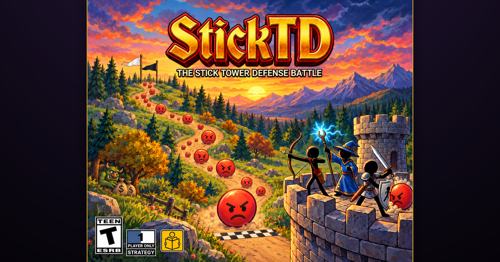

# StickTD — Stick Tower Defense

A free browser tower defense game by SauerNinja.

Living peaceful animals can reproduce as the map expands, letting you keep a small farm.

The road keeps growing. Build your defense, train the stickmen who hold it, and make room for the next wave. Clear 100 waves to reach endless play.

**[Play StickTD](https://sauerninja.github.io/StickTD/)** · [Full changelog](https://github.com/SauerNinja/StickTD/blob/main/CHANGELOG.md)



## Build your strategy

Build a reliable frontline, invest in the stats that suit each tower, and grow your options over time.

1. **Develop distinctive towers.** Each class brings its own role, combat style, and stat strengths.
2. **Unlock specialists through play.** Stat milestones and wave progress add new classes to the Build menu.
3. **Shape elemental attacks.** Attunements and mixed effects add distinct combat traits to your towers.
4. **Invest in growth.** Training and promotion give you more ways to develop each unit.
5. **Expand your battlefield.** New route and build space open as your campaign advances.
6. **Choose rewards for your run.** Milestone blessings, supplies and recovery help you shape a defense around the rewards you find.

## Contents

- [Build your strategy](#build-your-strategy)
- [How to play](#how-to-play)
- [Towers & evolutions](#towers--evolutions)
- [Tower appearance](#tower-appearance)
- [Enemies](#enemies)
- [Status effects](#status-effects)
- [Blood & gore](#blood--gore)
- [Training and Promotion](#training-and-promotion)
- [Waves](#waves)
- [Pathing & AI](#pathing--ai)
- [Items & Heroes](#items--heroes)
- [Resources](#resources)
- [Huts](#huts)
- [Lives](#lives)
- [Settings](#settings)
- [Save / Load](#save--load)
- [Tech stack](#tech-stack)
- [Project structure](#project-structure)
- [Code map](#code-map)
- [Running locally](#running-locally)
- [Contributing](#contributing)
- [Version History](#version-history)
- [License](#license)

## How to play

- Press **Play** to begin the regular campaign at Wave 1. On every new playthrough, a gentle hand points to **Build**, then to **Start Wave** once a defender is placed, then to the speed button once the first wave has started. Every campaign opens with a two-tile road, two grass tiles for building, and a single Barricade standing on the finish tile to hold the first arrivals while you set up. Your first expansion opens the rest of the grass around the road.
- Tap **Build**, choose a tower, then tap a hedge tile to place it. Each arrival gets a short class-flavored quip and a synthesized voice blip.
- Select a tower to view its portrait, health, experience, and combat stats. Open its nameplate for upgrades, movement, selling, equipment, targeting, and stat allocation.
- Train towers through combat and invest in their strengths. Stat milestones open specialist classes for your roster.
- Earn a choice reward after wave 3 and every tenth wave. Tap 🎁 or its notification to choose. Each choice explains its effect, with current supplies and healing shown in the popup; pending rewards remain available while you continue playing and are included in saves.
- The **speed control** (1x through 10x) only affects how fast enemies move and how fast towers attack; it never changes how long clearing a tree, rock or bush takes, or any other on-screen timer.
- Press **Start Wave** to begin the opening round; between rounds, the same control reads **Next Wave**. Clear waves to expand the winding battlefield. The free expansion for each cleared wave and any paid expansions extend the road a few tiles at a time. They are available between waves, even while an enemy that escaped is still loose: each cleared wave gives one free expansion as soon as it ends, and you can buy one more expansion per wave. Grass borders the road on every side, and a strip of grass always separates one stretch of road from the next where it curves and turns.
- The flags on the spawn tile ripple in a light, gusting breeze between waves and hang still once a wave begins.
- Face an endless sequence of waves with nine rotating archetypes and enemies that grow in size, strength, and rewards.
- Play with a mouse on desktop or touch controls on mobile. Pan, zoom, pause, and set the simulation speed from the HUD.
- Select an actively attacking tower to see its target's health, armor, and movement speed.
- Armor reduces each hit, but every hit always deals at least half of its damage, so rapid-fire towers keep some value against Tanks and Bosses.

### Stat icon legend

Every icon used across the HUD, a tower's inspect panel, its target frame, and its stat buttons:

**Top HUD bar**
| Icon | Meaning |
|---|---|
| ❤️ | Lives remaining — reaching 0 ends the run |
| 💰 | Gold — spent on building most towers, upgrading, expanding, and the Shop |
| 🔀 | Free tower relocations left (earn 1 more every 2 waves, capped) |
| 🏗️ Build / 🛒 Shop / ⚙️ | Open the build tray, item shop, or settings |
| ⏸/▶ and 1x/2x/.../10x | Pause/resume and simulation speed |

**Tower inspect panel — combat stats** (left to right: HP/armor first, then the damage cluster)
| Icon | Meaning |
|---|---|
| ❤️ | Current / max HP |
| 🛡️ | Armor — percentage damage reduction on incoming hits |
| ⚔️ | Damage, shown as its real min-max range (the actual random roll band every hit uses) |
| 💥 | Critical hits — shown as chance, then ⚔️ and the damage multiplier (e.g. "2.5% ⚔️1.20") |
| ⏳ | Full attack-cycle time, in seconds |
| 🥈 | Average damage per second, including expected critical hits and accuracy (burst-fire towers use their full attack cycle) |
| 🎯 | Range — attack radius in world units |

The stats row scales to fit on one line across panel widths.

**Tower inspect panel — stat allocation**
| Icon | Stat | What it does |
|---|---|---|
| 💪 | STR | Increases health with class-dependent, diminishing growth; drives Warrior-archetype damage and body weight |
| 🏃 | DEX | Improves attack speed, accuracy and 💥 critical chance; drives Archer-archetype damage, with a smaller attack-speed share for those classes |
| 🧠 | INT | Range grows in a straight line from the tower's starting range to its class maximum at 500 INT, plus 💥 critical damage per point; increases healing for Clerics and drives Mage damage |

Warrior damage scales with STR, Archer damage with DEX, and Mage damage with INT. DEX improves accuracy and critical chance across the roster; INT improves range and critical damage. Critical hits begin at 2.5% chance and 1.20x damage, with DEX and INT increasing those values up to their caps.

**Tower strategy (the aura box)** — specialist towers display a round glowing WC3-style icon
next to their inventory slots. Tap it for a concise note about the class's role and tactics.

**Target frame** (shown when a selected tower is actively attacking something)
| Icon | Meaning |
|---|---|
| 🛡️ | The target enemy's armor |
| 👟 | The target enemy's movement speed |

## Towers & evolutions

Build a defense from classes with complementary strengths. Training and wave milestones expand your roster, while elemental attunements and mixed effects add new character to a tower's attacks. Each class keeps a distinct combat role, from close-range defense to long-range damage, support, control, and utility.

| Tower | Role |
|---|---|
| ⚔️ Swordsman | Close-range warrior with broad melee attacks |
| 🏹 Archer | Draws and fires powerful long-range arrows |
| 🔮 Mage | Ranged magic with slowing and elemental effects |
| 🚧 Barricade | Durable path defense that stops an enemy at contact |
| 🔨 Hammerman | Shielded bruiser with stunning attacks |
| 🪓 Axeman | Switches between close swings and thrown axes |
| 👹 Berserker | Wide, hard-hitting melee attacks |
| 🔱 Spearman | Long-reach, deliberate melee strikes |
| 🎯 Lancer | Extended reach for controlling the frontline |
| ⚜️ Paladin | Holy attacks that cut through armor |
| 🔫 Gatling | Rapid fire for clearing groups |
| 🔪 Crazy Chef | Strength-driven kitchen knife thrower |
| 🥷 Ninja | Alternating throwing stars, rapid sustained attacks and point-blank targeting; earned through a hidden challenge |
| 🎯 Blowdart | Fast darts that poison targets |
| 🔫 Dual Squirt Gun | Dual-wielded elemental fire |
| ♨️ Blow Gunner | Combines poison and chilling effects |
| 🔫 Marksman | Measured rifle shots with extended range |
| 🎯 Sniper | High-impact attacks from the longest range of the archer classes |
| 🐈‍⬛ Cat Snapper | Sends shadow cats to pursue and scratch targets |
| ⚡ Snap Caster | Quick electric casts that can chain between enemies |
| ✝️ Cleric | Supports allies and curses undead foes |
| 💀 Necromancer | Dark magic and a temporary skeleton guard |
| 🧑‍🦳 Pope | Spreads a powerful curse across nearby enemies |
| 💣 Bomber | Explosive attacks against clustered enemies |
| 🔫 Gunalinder | Rapid revolver bursts followed by a long reload |
| 👳 Merchant | Keeps the Shop available and earns bonus gold |
| ⚙️ Glaive | Specialist attacks against huts and other structures |

Proton, Dark Matter, and Quasar are mixed elements earned by a stickman, not towers. Each combines the burn, freeze, and chain-lightning effects of its two parent elements. See **Elements** under [Training and Promotion](#training-and-promotion) for details.

Gold-tier upgrades improve range, cooldown, and class abilities while adding damage. A tower's primary stat remains its main source of combat growth.

**Range by role.** Every tower starts with a short range and gains reach only as INT grows, reaching its class maximum at 500 INT. The role sets how far that goes: melee classes have the shortest starting and maximum ranges, archer classes sit in the middle, and mage-style casters end up with the longest. Support classes (Cleric, Pope, Merchant, Glaive) keep their own short radii.

## Tower appearance

Each tower has an individual look shaped by its class, silhouette, and stat growth. Skin and clothing tones vary from unit to unit, while class colors and signature details keep the roster easy to read. STR investment adds a growing mustache, giving long-serving warriors a visible mark of their progress.

## Scenery

Bushes 🫐 join trees and rocks on the map, costing only a few gold to clear and dropping a random berry. Trees and rocks grow denser and larger the closer they are to the spawn flags or the finish line, tapering back to normal toward the middle of the road. This naturally favors building through the middle of the map, leaving both ends clearer as the road continues to grow.

## Enemies

Grunt, Swarm, Tank, and Runner make up the early roster, alongside a Boss on wave 15. Fire and
Ice enemies can break away from the path to challenge a tower one-on-one, inflicting burn or a slow
debuff. Splitter breaks into two smaller Splitmini on death; Boulder does the same but
tankier. Healer keeps nearby enemies topped up; Shielded absorbs hits until its shield breaks.
Wolf hunts in a coordinated pack. The Troll has a large bounty, roughly double HP, and walks backward toward the entrance. Defeat it before it escapes.

**Undead** (Zombie, Wraith, Skeleton, Reaper) carry real armor and are the intended target for a
Cleric's curse, which deals 5x damage to them specifically. Skeleton revives once on death.
Reaper is the heaviest-armored undead in the roster.

## Status effects

An enemy shocked by lightning that dies within three seconds discharges a burst to the enemies packed around it.

Burn, curse (poison-style DoT), bleeding (see [Blood & gore](#blood--gore)), slow, and stun are marked by periodic reminders and distinct visuals: drifting ice crystals, flickering flames, and orbiting lightning bolts. Crowd-control effects can spread through queued enemies, extending their impact along the route.

## Blood & gore

Blood and gore effects are on by default. Turn them off in Settings → Game. Every weapon and enemy brings its own visual signature to the battlefield.

- Bladed swings leave curved cast-off arcs, blunt impacts create broad spatter and shockrings, and piercing attacks produce narrow forward streaks.
- Impact scale reflects hit strength and enemy size. Species profiles distinguish insect hemolymph, undead residue, and the dust and stone chips of rock-bodied enemies.
- Running drips, bleeding wounds, barricade transfer smears, and footprints give combat a visible trail across the map.
- Stains pass from fresh red through oxidized brown to aged, layered patterns. Individual lifetimes and local density limits preserve definition along busy paths.
- Bone fragments of varied size, skulls (more often from bigger enemies), and burrowing worms add battlefield detail, with each effect drawn in its own layer. Red-blooded enemies show bright fresh blood that darkens to their own shade; other enemies keep their own colour.

## Training and Promotion

Each tower develops along two progression tracks, with **500 points per stat and 1,000 total**.

- **Training (XP):** enemy defeats award XP, with the largest share going to the tower that lands the final hit. Towers that helped receive an assist share based on damage. Every 100 XP rolls **2 × (1–3) stat points**. The inspect panel tracks this separately as Training XP and Training level.
- **Promotion (gold):** each promotion raises the tower's **Rank** (Rank 1, Rank 2, and so on). A promotion is worth five training bars: about 20 points rolled automatically across the stats (half of the dice into the tower's main stat) plus about 20 more points to spend yourself, all as random 1–3 rolls. Cost grows ×1.5 per rank (80 → 120 → 180 → 270 → …), with all rolls respecting the stat caps.

**Milestones.** At **500 total trained stats**, name a tower. At **1,000**, earn its training trophy and convert its XP share into gold at 25 XP per coin.

**Stat growth.** STR improves health and Warrior damage; DEX improves attack speed, accuracy, and critical chance, and drives Archer damage; INT improves range and critical damage, and drives Mage damage. Each tower's archetype defines its primary damage stat.

**Hacks.** Turn on *Hacks enabled* in Settings > Game to unlock the Hacker, a stickman who never fights. He sits holding a laptop, slips behind a smoke screen when attacked, and only one can be on the field at a time. Tap him to open the Hack Menu, a developer-style panel for granting resources, healing your roster, clearing enemies, and changing a few rules. Hacks are off by default and are not saved with your game.

**Elements.** Elements are earned by a stickman, never built as towers. At 250 points in a stat, any stickman is infused with Fire (STR), Electric (DEX), or Ice (INT), and its weapon visibly glows with that element. Infusing a second stat to 250 mixes the elements: Fire + Electric becomes Proton, Fire + Ice becomes Dark Matter, and Electric + Ice becomes Quasar. With all three stats at 250, the two highest stats decide. Fire burns like a bleed, Electric chains lightning between enemies, and Ice, the rarest to trigger but the most effective, freezes an enemy for two to five seconds so it blocks the line behind it and takes extra damage; a mixed element applies both of its effects. Elemental effects appear on projectiles and melee strikes with a proc chance that scales with stat investment.

**Class unlocks.** Stat milestones and wave progress reveal new specialists in the Build menu’s **Stickmen Defenders** section. Elemental attunement opens class-specific branches; some towers have further specialist paths.

**Spending points.** Tap a stat to spend one point or hold to continue spending. The panel previews upcoming progression milestones.

**Targeting modes.** Choose First, Closest, Strongest, Weakest, Farm, Assist, or Unclaimed to set how each tower selects its targets.

## Waves

Every wave follows a size order: Tiny, Small, Standard, then Large enemies and Bosses on every fifth wave. Dispatch advances as each group clears the route or reaches the finish. Larger enemies move more slowly, bring greater strength, and offer more XP. Enemies walk at a measured pace and arrive well spaced, so your towers have time to line up each target. Wave plans include plentiful smaller foes alongside major threats.

Every wave from the second on is dealt in one of six formations: a steady stream, a surge of big groups, a trickle of small ones, alternating pulses, building pressure, or an irregular rhythm. Sometimes a family travels together in convoys. The same non-steady formation never comes twice in a row. The longer your road is compared with what is expected for the wave, the more small and standard enemies come and the bigger each group is (up to 2.5 times), so a huge road on the first wave means a bigger first wave. Batches arrive a quarter closer together from the second wave on. Every wave also has half again as many small and standard enemies as its base plan (a smaller bonus after wave 50), so there is always plenty to fight; enemies are exactly as strong as before.

The opening 15 waves introduce enemy families gradually, with a short guide to each type's health, speed, bounty, and abilities. End-of-wave summaries report gold gained and experience earned by class.

After wave 100, nine rotating wave archetypes provide varied pacing, enemy mixes, and combat challenges. Bosses can summon Grunt minions, with a compass marker to track those out of view. Spacing keeps the entrance clear as groups arrive.

## Pathing & AI

Enemies follow the road in single file, forming natural queues at Barricades. Swept collision checks keep fast-moving units in contact with the route and one another. Dispatch adapts to a backed-up queue, and a safety timeout helps combat resume if movement stalls. Waypoint margins guide clean turns around spiral corners.

Each expansion grows both ends of the road by the same one to three tiles, and the road is always surrounded by grass: the green area is only ever added to, and a stickman is never left outside it. The road grows in varied styles: mostly normal winding, with zigzags, long runs, and now and then a wild hook or coil. It is kept from cutting itself off, and the road avoids the tiles your stickmen stand on; if it ever must take one, that stickman is moved onto the nearest grass. Expansions are available between waves once every enemy, including any that escaped, is defeated.

Each expansion also makes one random event near the spawn flags and one near the finish: a present, a supply crate, a berry bush, a farm animal, a fountain or campfire, a picnic basket (a meat, a fruit and a vegetable), a wood pile, a bird nest or a mushroom patch. Presents are the rarest and are a loot roll (coins, a gold bag, a stim or berries), so a gold bag comes from only about three presents in ten. Near the start the land is green meadow with leafy trees. Far down a very long road the world changes in wavy patches, like biomes: cool Pinewood with evergreens and sandy Dunes with palm trees. Trees and rocks are mirrored and sized differently, so no two corners of the map look alike.

## Items & Heroes

Defeated enemies sometimes leave an item on the road. Equipment shines with a rarity-based glow, from Common through Uncommon and Rare to Epic; currency coins and bags glow gold. Drag an item onto any stickman to equip it; each item adds Strength, Dexterity, Intelligence or Armor. More than forty items are waiting to be found. Tennis Shoes grant +2 Dexterity and one free tower move at the start of every round for each pair carried; a rare Shovel can uncover food, bones or equipment when used nearby.

- **Signature drops.** Many enemies carry an item of their own. Grunts may drop a Headband, Tanks a Granite Heart, Trolls a Bridge Toll, Zombies a Grave Charm and Wraiths a Spectral Veil, and Bosses always leave a special item along with a strong general one. Larger enemies are more likely to drop items than smaller ones.
- **Your inventory.** Every stickman has six item slots. Select a stickman and open its nameplate to see the items it carries, with their stats. Drag an item out to give it to another stickman, or leave it on the ground for later. A stickman with spendable stat points can tick **Auto spend** beside them to have new points spent on his main stat automatically. Uncollected items wait on the battlefield for several minutes. Food, potions and other consumables wait in the slots until you tap them or press their number key.
- **First map reward.** One of your first five eligible enemy defeats drops a map scroll. Click it to reveal a free expansion. There is only one kind of bag, the normal gold bag, and it has a luck roll: about one bag in a hundred lets a Map fall out when it opens or times out. Click the Map for a free expansion.
- **Shop items.** The **Lucky Branch** 🌿 (+1 STR/+1 DEX/+1 INT, gold and wood) and the **Barricade** 🚧 (see Resources below) can be bought for the selected stickman. Global passive upgrades apply to every stickman you own, present and future.
- **Heroes.** A stickman with all six slots filled is promoted to **Hero**, with a permanent stat bonus, a visible crown and its own sound. A stickman whose STR, DEX and INT total 100 becomes **Legendary**, a rarer milestone with its own permanent bonus, a name of your choice and the biggest fanfare in the game.


## Food & Medical Supplies

Fallen enemies, picnic baskets, bushes and mushroom patches leave food: Fruit, Vegetables, and Meat. Food is eaten the moment you drop it on a stickman and is mainly there to raise stats, like the vitamins and berries in Pokemon: **meat raises STR, fruit raises INT and vegetables (potatoes and the rest) raise DEX**. Every food gives 1 to 3 points of its stat and 1 to 10 experience, rolled when it is eaten. Boss Treats and stims are still carried like any other item: drag one onto a stickman to store it in an item slot, then click the slot or press its key to use it.

- **Fruit** — +1 INT, plus a little experience scaled to how far the campaign has progressed.
- **Vegetables** — +1 DEX (a Hot Pepper gives +2), plus a small heal.
- **Meat** — +1 STR for Bacon and a Drumstick, +2 for Steak and +3 for Meat on the Bone, plus the lives and maximum lives it already gave.
- **Livestock.** Chickens, pigs and cows sometimes wander onto the map as it expands, grazing slowly and safely unless singled out.
- **Target marking.** Click any enemy — or one of the animals above — to place a target marker over its head. Every tower on the map will prioritize that target while it stays in range, letting you call the shot on a dangerous enemy or send your defenses after a wandering animal for its meat.
- **Boss Treats.** Every Boss and Holiday Boss leaves behind a Treat — a single guaranteed reward bundling a life restore, experience, and sometimes bonus gold.
- **Cooking and the Campfire.** 🔥 Now and then a Campfire — a fire on two crossed logs — appears near the road after the third wave. It is the only place to cook. Tap it to add wood (15 🪵 buys 2 fuel, up to 8); it burns one fuel at the end of every wave and goes cold at zero. A stickman standing near a lit fire can combine stored foods with the Combine button, spending fuel from the fire. Simple pairs cost 1 fuel: Bacon and Potato make a Breakfast Plate (attack speed), Steak and Carrot a Hearty Stew (restores health), Apple and Blueberries a Fruit Salad (range), Meat on the Bone and a Drumstick a Roast Feast (damage). Complex recipes take three or four foods and 2–3 fuel: Bacon, Potato and Corn make a Sunrise Skillet; Steak, Garlic and Hot Pepper a Fiery Ragout; Strawberries, Cherries and Blueberries a Berry Pie; Carrot, Potato, Corn and Hot Pepper a Harvest Curry that boosts damage, speed and range and heals. Meals are used like stims and last until the end of the round.
- **Supply crates.** 📦 Crates found as scenery open for 10 gold and hold a stim: Adrenaline (attack speed), Combat Stim (damage), Spotter Scope (range), Field Medkit (heals 40%), or the rare Hyper-Serum (all three). Stim buffs last until the end of the round they are used in.
- **Berry bushes.** 🪴 Potted bushes are smaller, clear for a flat 5 gold, and drop two or three berries.
- **Gold bags and the wandering troll.** Clicking a gold bag immediately adds its exact value to your player gold. Unopened bags keep their value and pay out automatically after three minutes. Coins from a chest or Merchant are separate currency pickups: click a landed coin to collect its value, or leave it to disappear after 5–15 seconds. Chests and, rarely, fallen enemies drop Gold Bags that pay their listed amount directly when opened. Trolls on the road also carry gold bags. From wave 5 onward, a wandering troll may stroll the road and club any stickman it stumbles upon; target it and defeat it for 2–3 bags. About one bag in ten also drops a diamond that falls into the landscape like a coin; hovering never collects a diamond, you have to click or tap it, and it turns into 1 to 100 gold and the gem flies up into the gold counter. Coins fly up to the gold counter when you collect them and when they fade out on their own. Dropped items fly out in an arc and land on the grass beside the road, not on it.
- **Stickman chatter.** Stickmen occasionally show a mood emoji and a short line at key moments — low health, a swarm, a leak, a boss kill, a close call. It only happens sometimes, for fun.
- **Medical Supplies**, sold in the Shop, are held in reserve and used automatically: the Bandage and First Aid Kit restore lives on purchase, and the Defibrillator is carried until the moment it's needed — intercepting a defeat and reviving the base at 25% lives.

## Resources

Earn gold from enemy defeats and wave clears. Gather wood and stone from trees, rocks, treasure chests, and relic drops to fund premium equipment and Barricades.

Barricades are unlimited, and each one already standing on the field makes the next cost more wood and stone: the second is modest, then the price climbs steeply. Buy the Barricade item from the Shop, place it from a tower's inventory onto a valid path tile, then store or transfer it as your defense changes. Every five waves banks one free Barricade charge, up to three. Tanks add stone to the battlefield when defeated.

## Huts

Guarded huts bring optional objectives and valuable rewards to the expanding map. Two guardians defend each camp and retaliate when a tower attacks. Defeat the guardians for gold, then destroy the hut for a larger reward and building materials. Camps can recruit fresh guardians when the nearby lane is clear.

## Chance structures

Now and then, when a wave is cleared, a rare structure appears on the grass beside the road. Right now that is the **Healing Fountain** (⛲): tap it to restore up to 10 lives, never above your maximum. It keeps whatever healing you did not need and disappears once all 10 are spent. The more hurt you are, and the longer it has been since one appeared, the better the chance, but never before wave 2 and never more than one on the board.

## Lives

Start with 100 lives. Extra lives are available in the Shop, with costs that rise after each purchase.

An enemy costs a life when its full body crosses the checkered finish line. An enemy that gets through and is still alive is *loose*, and each loose enemy costs another life every 6 seconds until it is defeated, so a wave that slips past keeps the pressure on. The count appears under the Next Wave button and clears when none are left. Loose enemies stay on the road and its grass border. Any change to your lives appears beside the health counter, red when you lose lives and green when you gain them. Escaped enemies remain on the map as live targets across waves, and defeating them earns a gold and XP cleanup reward. During breaks between waves, wandering enemies may hunt nearby towers. A loose enemy sits in a soft red glow so it is easy to find.

## Settings

**Choose your visual style.** Low graphics is the starting point for phones and laptops with integrated graphics, with automatic render resolution enabled to lower GPU load when frames stay slow; turn this assist off in Settings if you prefer full sharpness. High graphics adds richer effects, including weight-based screen shake, for capable desktops and console-class hardware. Actual performance depends on your device and browser, so switch whenever you like. The resolution assist checks frame pacing every few seconds and can lower render resolution after sustained slow frames. Its default Low-profile floor is 75%; you can set a different floor or turn the assist off in Settings → Video.

An introduction (bouncing hand arrows) points to Build, then Start Wave, then the speed button, and plays on every new playthrough.


Video (graphics quality: Low / High, trading off shadows and particle-heavy effects for
performance), Audio (overall, music and sound-effects levels, plus mute), Game (blood and gore toggle, save/load, and **Reset options**), Changes (recent release notes), and About (in-app README
viewer/downloader, plus **Download Debug Log** — one text file with live performance stats, full
game/settings state, audio engine status, entity pool counts, and browser/device info, for
attaching to a bug report).

**Blood and gore** are on by default and can be turned off in Settings → Game. **Reset options** (Settings → Game): **Clear Unlocks** removes every earned tower unlock, and **Clear All Cookies & Data** also removes the cookie choice, settings and first-tower cue progress. Both restart your run, so Santa's cookie notice, the Build hand cue, Item Guide and enabled first-wave tips can appear again with no towers and nothing unlocked. Each asks for confirmation first; downloaded save files are not touched.

## Save / Load

Settings → Game → **Save Game** downloads a `.txt` file with a random seed and your campaign: road, map, stickmen with their stats and items, gold, wave progress and loose items. A fight in progress is not stored: if you save in the middle of a wave, that wave starts again when you load. Loading is all or nothing; if a file is damaged your current game is left as it was. **Load Save** restores that campaign on this device or another.

## Tech stack

- **HTML5 Canvas 2D** draws stickmen, weapons, enemies, particles, and decals procedurally.
- **Vanilla JavaScript** powers the game and its interface.
- **Web Audio API** synthesizes the original soundtrack and sound effects in the browser. The field arrangement gains a steady pulse during combat; music, sound effects and overall volume have separate controls.
- The game lives in `index.html`, with `CHANGELOG.md` alongside it for in-game release notes.

## Project structure

```
StickTD/
├── index.html      # game markup, styles, and logic
├── AGENTS.md        # workflow rules for AI agents/contributors making changes
├── CHANGELOG.md      # full version history, newest first — the single source of truth; the in-game "what's new" dialog fetches this file directly
├── BACKLOG.md        # ideas and planned features not yet built
├── LICENSE            # MIT
└── README.md          # this file
```

## Code map

Direct links into `index.html` on GitHub, jumping straight to where each system actually lives.
Use the section headers around each destination to navigate when line references shift.

**Wave, XP and performance systems** — search for these names:
- `buildWavePlan()` / `validateWavePlan()` / `SIZE_TIER_BANDS` — seeded wave construction, size
  tiers, boot-time validation of waves 1–120.
- `advanceWaveDispatch()` / `currentBatchReleased()` — phase-strict, batch-overlapping dispatch.
- `Enemy.applySizeTier()` / `Enemy.packedSpeed()` / `Enemy.recordContribution()` — size stats,
  tier speed ceiling, damage ledger.
- `awardKillExperience()` / `creditKill()` / `distributeSharedXp()` / `gainTowerExp()` — XP.
- `Tower.upgrade()` / `promotionCostFor()` / `promotionCapacity()` / `Tower.targetScore()` — promotion and targeting.
- `STAT_EFFECT_CAP` / `STAT_TOTAL_CAP` / `refreshProgressionMilestones()` / `progressionMilestoneNote()` — stat caps, naming at 500, mastery at 1,000, XP-to-gold.
- `MIXED_ELEMENT_RULES` / `refreshElementState()` / `applyAttunementStatus()` / `ELEMENT_VISUALS` — element mixes, on-hit status and the elemental projectile/swing visuals.
- `dpsBreakdownText()` / `maybeShowUpdateNotice()` — the tap-to-explain DPS panel and the what's-new dialog.
- `drawDebugOverlay()` / `panCameraToTower()` / `Tower.drawBloodLustAura()` — debug mode, killstreak pan and aura.
- `sweepSettledDecals()` / `isDecalBakeEligible()` / `blitWorldLayer()` — gore baking and
  viewport-cropped world layers.
- `buildEnemyHash()` / `spatialCellKey()` / `queryNearby()` — integer-keyed spatial hash.
- `applyPanInertia()` / `requestPausedRender()` — camera glide and paused-render coalescing.

**Items, clicks and world rules** — search for these names:
- `useStoredConsumable()` / `showItemUseFeedback()` / `ITEM_USE_CLASSES` — storing and using consumables, and the one-moment feedback on each use.
- `refreshQuickUse()` / `updateQuickSlots()` / `updateBuffPips()` — the quick-use row above the panel and the nameplate buff pips.
- `makeItemInstance()` / `itemLogReport()` / `logGameEvent()` / `renderItemCodex()` — the item log, game event log and Items tab.
- `FIRST_MAP_DROP_KILL` / `GOLD_MAP_BAG_ITEM` / `serializeGameState()` — early free-expansion rewards and their save/load data.
- `dropGoldBag()` / `tryOpenGoldBagAt()` / `isWithinEmojiSquare()` / `sceneryAtPoint()` — gold bags and the emoji-border click areas.
- `tryClaimRandomEventSlot()` / `runWaveClearRandomEvents()` — up to two endpoint events per expansion.
- `treeRockSizeFrac()` / `fillEndRing()` / `harvestedTileKeys` — scenery sizes by distance from the road ends and cleared-tile memory.
- `enemyPresenceDirty` / `PROJECTILE_AMMO_BY_TOWER` / `projectileStickKind()` / `bleedSourceAllowed()` / `frameCapIntervalMs()` — cached enemy presence, ammo shapes, embedded projectile bleed and the frame-rate limit.

**Major sections**
- [Config (tunables, tower/enemy stat tables)](https://github.com/SauerNinja/StickTD/blob/main/index.html#L1244)
- [Map / path generation](https://github.com/SauerNinja/StickTD/blob/main/index.html#L2902)
- [Scenery (trees/rocks)](https://github.com/SauerNinja/StickTD/blob/main/index.html#L3565)
- [`CONFIG.FLORA` / `spawnFlora()` — sparse cosmetic ground-cover accents, baked into the static map layer](https://github.com/SauerNinja/StickTD/blob/main/index.html#L2352)
- [`spawnLeafGust()` / `updateAndDrawBlowingLeaves()` — one ambient gust of leaves drifting across the screen, 20-60s into a game](https://github.com/SauerNinja/StickTD/blob/main/index.html#L10827)
- [`ATTUNEMENTS` / `SPECIALIZATIONS` — the two-stage elemental attunement (100, permanent lock) + specialization (500) tables](https://github.com/SauerNinja/StickTD/blob/main/index.html#L1630)
- [`checkAttunementAndSpecialization()` — the runtime check for the above, called from `checkEvolution()` for the 3 base classes only](https://github.com/SauerNinja/StickTD/blob/main/index.html#L9480)
- [`unlockedTowerTypes` / `unlockTowerTypeBuild()` — unlocks tower types for direct Build-menu purchase](https://github.com/SauerNinja/StickTD/blob/main/index.html#L1734)
- [Audio synthesis (`SoundEngine`)](https://github.com/SauerNinja/StickTD/blob/main/index.html#L5703)
- [Game state / save-load](https://github.com/SauerNinja/StickTD/blob/main/index.html#L6121)
- [Camera (zoom + pan)](https://github.com/SauerNinja/StickTD/blob/main/index.html#L7598)
- [Entity classes (Enemy, Tower, Projectile)](https://github.com/SauerNinja/StickTD/blob/main/index.html#L7772)
- [Stickman rendering](https://github.com/SauerNinja/StickTD/blob/main/index.html#L12201)
- [Spatial hash](https://github.com/SauerNinja/StickTD/blob/main/index.html#L13049)
- [Waves](https://github.com/SauerNinja/StickTD/blob/main/index.html#L13345)
- [Main loop (fixed timestep)](https://github.com/SauerNinja/StickTD/blob/main/index.html#L14017)
- [Canvas / input setup](https://github.com/SauerNinja/StickTD/blob/main/index.html#L15529)
- [UI wiring](https://github.com/SauerNinja/StickTD/blob/main/index.html#L16058)
- [Start / end screens](https://github.com/SauerNinja/StickTD/blob/main/index.html#L18073)
- [Boot](https://github.com/SauerNinja/StickTD/blob/main/index.html#L18161)

**Core gameplay systems**
- [`CONFIG.TOWERS` (per-tower stats/tiers)](https://github.com/SauerNinja/StickTD/blob/main/index.html#L1859)
- [`CONFIG.ENEMIES` (per-enemy stats)](https://github.com/SauerNinja/StickTD/blob/main/index.html#L2132)
- [`SPLIT_CHILD_TYPE` — which fragment type a splitting enemy leaves behind (Splitter→Splitmini, Boulder→Rocklet)](https://github.com/SauerNinja/StickTD/blob/main/index.html#L1481)
- [`updateBarricadesAndPileup()` — barricade contact, enemy queueing](https://github.com/SauerNinja/StickTD/blob/main/index.html#L3388)
- [`computeFinishLine()` — shared geometry for the finish-line carpet and full-body crossing check; `reachEnd()`/`updateEscaped()` — escaped enemies remain active targets](https://github.com/SauerNinja/StickTD/blob/main/index.html#L4396)
- [`class Enemy`](https://github.com/SauerNinja/StickTD/blob/main/index.html#L6584)
- [`class Tower`](https://github.com/SauerNinja/StickTD/blob/main/index.html#L7887)
- [`class Projectile`](https://github.com/SauerNinja/StickTD/blob/main/index.html#L9182) — includes `pointSegmentDist2()`, the swept-collision check that stops fast projectiles (Mage especially) tunneling through moving targets
- [`class CatCompanion`/`drawCat()`](https://github.com/SauerNinja/StickTD/blob/main/index.html#L10703) — Cat Snapper's pooled temporary companion (follows its target's current x/y, never the path itself) and the shared procedural cat renderer both the companion and Cat Snapper's own idle pose use
- [`class SkeletonMinion`/`raiseSkeletonsForTower()`](https://github.com/SauerNinja/StickTD/blob/main/index.html#L10818) — Necromancer's pooled round-scoped minions (raised in `startNextWave()`, destroyed on wave-complete), and `drawSkeleton()` just below it
- [`findTarget()` — per-tower targeting, including Mage's wide hysteresis margin to avoid mid-charge target snapping](https://github.com/SauerNinja/StickTD/blob/main/index.html#L8316)
- [`drawStickman()` — procedural tower/weapon rendering](https://github.com/SauerNinja/StickTD/blob/main/index.html#L10906)
- [`checkStallWatchdog()` — anti-bunching failsafe](https://github.com/SauerNinja/StickTD/blob/main/index.html#L11554)
- [`resolveSweptEnemyCollisions()` / `resolveEnemyCollisions()`](https://github.com/SauerNinja/StickTD/blob/main/index.html#L11600)
- [`buildWavePlan()` — seeded wave construction, including the rotating wave archetypes after wave 100](https://github.com/SauerNinja/StickTD/blob/main/index.html#L11926)
- [`validateGameDefinitions()` — boot-time cross-reference check across every data-driven config table](https://github.com/SauerNinja/StickTD/blob/main/index.html#L2203)
- [`update(dt)` — the actual per-frame simulation tick](https://github.com/SauerNinja/StickTD/blob/main/index.html#L12445)
- [`render(ctx)` — the actual per-frame draw call](https://github.com/SauerNinja/StickTD/blob/main/index.html#L12670)
- [`updateHUD()`](https://github.com/SauerNinja/StickTD/blob/main/index.html#L14385)
- [`fitHudTopToOneLine()` — scales the top bar to fit narrow screens](https://github.com/SauerNinja/StickTD/blob/main/index.html#L13906)
- [`updateInspectPanel()`](https://github.com/SauerNinja/StickTD/blob/main/index.html#L15693)

**Blood & gore system** (see [Blood & gore](#blood--gore) above for the player-facing description)
- [`getBloodProfile()` / `rollBloodProfile()` — per-species base palette + per-instance color jitter](https://github.com/SauerNinja/StickTD/blob/main/index.html#L9657)
- [`bloodTintForFire()` — sooty/darkened tint for wounds taken while burning](https://github.com/SauerNinja/StickTD/blob/main/index.html#L9638)
- [`resolveGoreArchetype()` / `resolveWeaponSubtype()` — which forensic taxonomy branch a hit uses](https://github.com/SauerNinja/StickTD/blob/main/index.html#L9722)
- [`spawnDecal()` — the main ground-pool particle system, archetype-specific shape/size table lives here](https://github.com/SauerNinja/StickTD/blob/main/index.html#L9736)
- [`spawnCastOffArc()` / `spawnBloodCastoff()` — directional cast-off streaks (Blade's swing arc, Mage's radiating cone)](https://github.com/SauerNinja/StickTD/blob/main/index.html#L9801)
- [`towerSwingDir()` — per-tower swing handedness for consistent cast-off arcs](https://github.com/SauerNinja/StickTD/blob/main/index.html#L9797)
- [`spawnSwingArcGuide()` — the "air line": a brief visible trace of the blade's actual swept path, geometrically identical to the angle driving the real cast-off blood](https://github.com/SauerNinja/StickTD/blob/main/index.html#L10398)
- [`spawnSatelliteDrops()` — secondary scattered droplets, distance-scaled elongation](https://github.com/SauerNinja/StickTD/blob/main/index.html#L9901)
- [`spawnShockring()` — Blunt's partial-arc impact ring, biased away from the attacker](https://github.com/SauerNinja/StickTD/blob/main/index.html#L10374)
- [`spawnPunctureMark()` — Archer's dark, understated entry-wound mark](https://github.com/SauerNinja/StickTD/blob/main/index.html#L9883)
- [`spawnExpiratedMist()` — air-diluted pale mist + bubble specks, an occasional death-time flourish independent of weapon type](https://github.com/SauerNinja/StickTD/blob/main/index.html#L10456)
- [`spawnBoneDebris()` / `spawnSkullDrop()` / `spawnWormFromSkull()` — skeletal remains and worms that emerge from skulls](https://github.com/SauerNinja/StickTD/blob/main/index.html#L9838)
- [`updateWalkingBlood()` — footprints (swipe) and pool disturbance (wipe), both distinct BPA mechanisms](https://github.com/SauerNinja/StickTD/blob/main/index.html#L9941)
- [`playImpactSound()` — per-archetype impact audio, scaled by the same hit-power roll driving the visuals](https://github.com/SauerNinja/StickTD/blob/main/index.html#L5262)

## Running locally

Run the game with a static file server:

1. Clone or download the repo — keep `index.html` and `CHANGELOG.md` together, same folder.
2. Serve the folder with any static file server, e.g.:

```
python3 -m http.server 8000
```

Then open `http://localhost:8000/`. Serving the folder over HTTP(S) also enables the in-game update panel to load `CHANGELOG.md` alongside the game.

## Contributing

See [AGENTS.md](AGENTS.md) for project conventions, verification steps, and contributor guidance. Review the current game and source files before changing project behavior; record shipped changes in [CHANGELOG.md](CHANGELOG.md).

## Version history

Current version: **1.7.75**. See [CHANGELOG.md](CHANGELOG.md) for the full version history (every release has a numbered, dated entry), and [BACKLOG.md](BACKLOG.md) for
ideas not yet built.

## License

MIT — see [LICENSE](LICENSE).

Made by [SauerNinja](https://github.com/SauerNinja).

When you use **Move** on a stickman he now walks to the new tile with a walking animation instead of jumping there, and cannot attack until he arrives. **Tennis Shoes** are a normal item (+2 DEX) that also give one free move at the start of every round for each pair a stickman carries; nothing needs to be used.

Items are meant to feel like finds: only a small share of defeated enemies drop one, supplies are more common than tonics and gear, and rare and epic gear is uncommon (about 7% and 1% of gear rolls).

While you clear a tree, rock or bush, a yellow gradient clock-wipe circle fills clockwise behind it until it is done.

The Hero Shop (it needs a living Merchant) also has a **Market** of rations (+2 STR, INT or DEX, eaten at once), a **Training Yard** (experience for a stickman) and a **Travelling Merchant** with three new pieces of gear every wave; the prices rise with every purchase, so there is always somewhere to spend gold.
